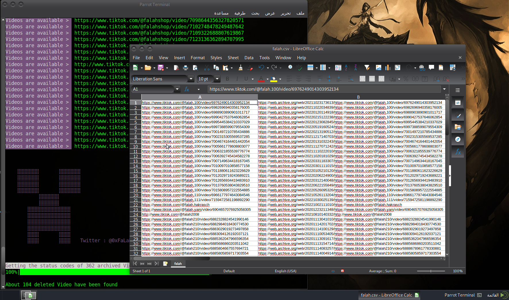

# TikTok-Back
Automate downloading of deleted archived _'TikTok'_ videos
+ **Hello AR:**  🍬 ! يستغرق البحث عن الحسابات او المقاطع المحذوفة وتنزيلها وقتًا طويلاً. لحسن الحظ ، مع هذه الأداة ، تصبح قطعة من الحلوة
+ **Hello EN:** It takes a long time to find and download deleted accounts or clips. Fortunately, with this tool, it becomes a piece of sweet! 🍬
## Enter your desired username, and let Botback do the rest ! 🤖
</p>
<p align="center">
    
</p>


```bash
    $ git clone https://github.com/0xfff0800/TikTok-Back.git
    $ cd TikTok-Back
    $ pip3 install -r requirements.txt
```

## Usage
>    botback.py -u USERNAME [OPTIONS]
    
    -u, --username                                        Specify target user's Tiktok handle

    --batch-size                                          Specify how many URLs you would like to 
                                                          examine at a time. Expecting an integer between
                                                          1 and 100. A larger number will give you a speed
                                                          boost but at the risk of errors. Default = 100

    --semaphore-size                                      Specify how many urls from --batch-size you would 
                                                          like to query asyncronously at once. Expecting an integer
                                                          between 1 and 50. A larger number will give you a speed
                                                          boost but at the risk of errors. Default = 50
    
    -from, --fromdate                                     Narrow search for deleted Video *archived*
                                                          on and after this date
                                                          (can be combined with -to)
                                                          (format YYYY-MM-DD or YYYY/MM/DD
                                                          or YYYYMMDD, doesn't matter)
                                                          
                                            
    -to, --todate                                         Narrow search for deleted video *archived*
                                                          on and before this date
                                                          (can be combined with -from)
                                                          (format YYYY-MM-DD or YYYY/MM/DD
                                                          or YYYYMMDD, doesn't matter)


    --proxy-file                                          Provide a list of proxies to use. You'll need this for checking large groups of video
                                                          Each line should contain one url:port to use
                                                          The script will pick a new proxy from the list at random after each --batch-size       

    
    Logs                                                  After checking a user's video but before you
                                                          make a download selection, a folder will be created
                                                          with that username. That folder will contain a log of:
                                                          <deleted-twitter-url>:<deleted-wayback-url> in case you needed them

    Examples:
    
    python3 botback.py -u falah                                         Downloads all of @falah's
                                                                        deleted Video
    
    python3 botback.py -u falah -from 2022-01-05                        Downloads all of @falah's
                                                                        deleted Video
                                                                        *archived* since January 5,
                                                                        2022 until now
    
    python3 botback.py -u falah -to 2022/02/09                          Downloads all of @falah's
                                                                        deleted Video *archived*
                                                                        since the beginning until
                                                                        February 9, 2022
    
    python3 botback.py -u falah -from 2020-08-30 -to 2020-09-15         Downloads all of @falah's
                                                                        deleted Video *archived*
                                                                        between August 30, 2020 to
                                                                        September 15, 2020
    
    python3 botback.py -u falah --proxy-file proxy.txt                  Provide a list of the proxy to use.
                                                                        From the file included in the folder, 
                                                                        replace the proxies if needed

    
(Replace `falah` with your target handle).


For more information, check out the [Usage](#usage) section above.

## Screenshots

Screenshots are done using Playwright. To successfully take screenshots, please follow these steps:
 1. Open a terminal window.
 2. Run: `playwright install`.

## Troubleshooting
The default speed settings for `--semaphore-size` and `--batch-size` are set to the fastest possible execution. Reduce these numbers to slow down your execution and reduce the chance of errors. 
For checking large numbers of tweets (> than 800) you'll need to use web proxies and `--proxy-file` flag

## Things to keep in mind
 - Quality of the HTML files depends on how the Wayback Machine saved them. Some are better than others.
 - This tool is best for text. You might have some luck with photos. You cannot download videos.
 - By definition, if an account is suspended or no longer exists, all their video would be considered deleted.
 - Custom date range is not about when Tweets were made, but rather when they were _archived_. For example, a video from 2011 may have been archived today.

## Telegram 👋
Follow our channel for more tools

try: [http://t.me/xfff0800](http://t.me/xfff0800) 
